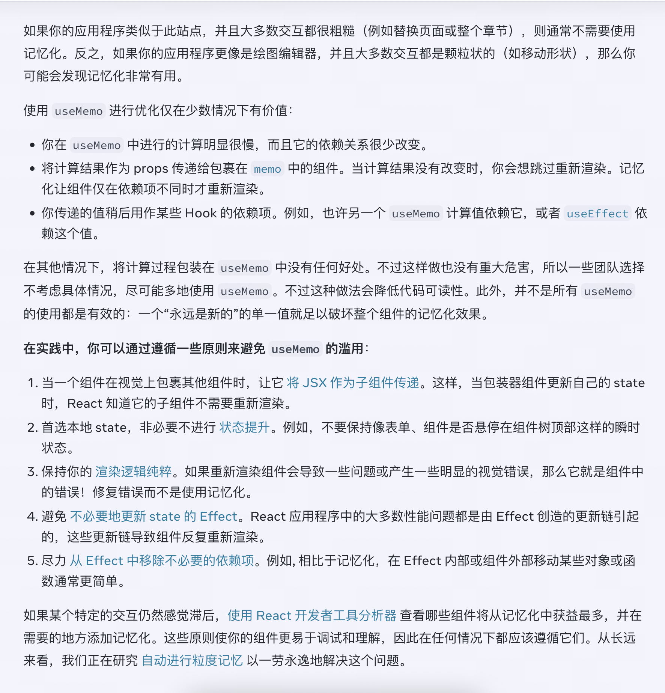

## 1, 背景

## 2, 是什么

是一个 babel 插件, babel-plugin-react-compiler

react 19 代码演示

$是一个混存数组, 每一个值都代表缓存的值

[ins 主页应用](https://www.instagram.com/zuck/?hl=en)

## 3, 工作原理

React Forget 可以生成等效于 useMemo、React.memo 的代码，并不意味着编译后的代码会出现上述 API，而是会出现「效果等效于上述 API」的辅助代码。

[react compiler playground](https://playground.react.dev/)

## 4, 低版本react使用

react hooks都具有缓存功能